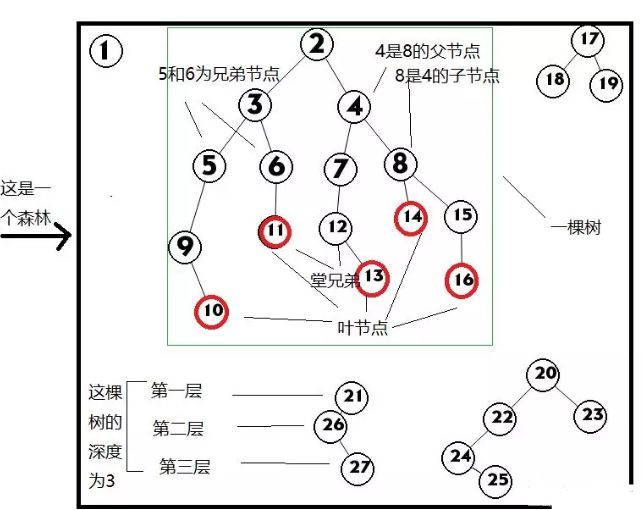

## 树形结构

和树有关的术语
- 节点的度：一个节点含有的子树的个数称为该节点的度；
- 叶节点：度为0的节点称为叶节点；
- 分支节点：度不为0的节点；
- 父节点：若一个节点含有子节点，则这个节点称为其子节点的父节点；
- 子节点：一个节点含有的子树的根节点称为该节点的子节点；
- 兄弟节点：具有相同父节点的节点互称为兄弟节点；
- 树的度：一棵树中，最大的节点的度称为树的度；
- 节点的层次：从根开始定义起，根为第1层，根的子节点为第2层，以此类推；
- 树的高度或深度：树中节点的最大层次；
- 堂兄弟节点：双亲在同一层的节点互为堂兄弟；
- 节点的祖先：从根到该节点所经分支上的所有节点；
- 子孙：以某节点为根的子树中任一节点都称为该节点的子孙。
- 森林：由m（m>=0）棵互不相交的树的集合称为森林；