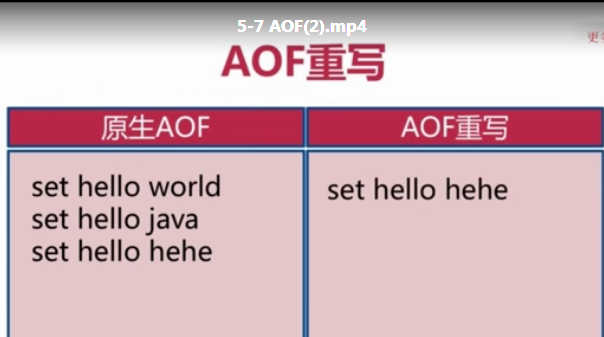
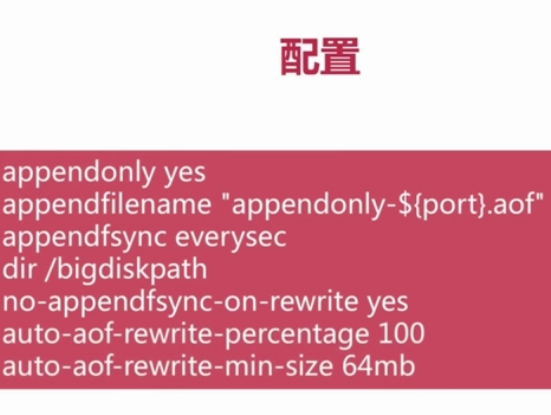

## redis 持久化相关
### rdb


生成快照三种方式
- 1，save同步生成，会堵塞


- 2,bgsave异步生成， 不会堵塞


- 3,触发自动生成
修改配置文件


```$xslt
redis单核，利用多核需开启多个redis实例
```

### aof

- 1, always


- 2, everysec


- 3, no


#### aof重写





