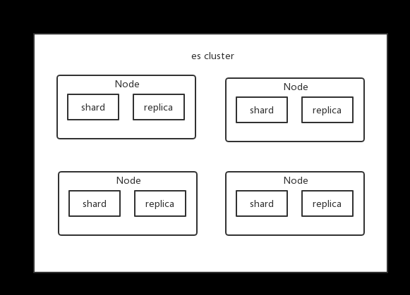

## 基础知识

### Near Realtime
近实时，有两层意思：
- 从写入数据到数据可以被搜索到有一个小延迟（大概是 1s）
- 基于 ES 执行搜索和分析可以达到秒级

### Cluster 集群
- 集群包含多个节点，每个节点属于哪个集群都是通过一个配置来决定的，对于中小型应用来说，刚开始一个集群就一个节点很正常。

### Node 节点
- Node 是集群中的一个节点，节点也有一个名称，默认是随机分配的。默认节点会去加入一个名称为 elasticsearch 的集群。如果直接启动一堆节点，那么它们会自动组成一个 elasticsearch 集群，当然一个节点也可以组成 elasticsearch 集群。

### Document & field
文档是 ES 中最小的数据单元，一个 document 可以是一条客户数据、一条商品分类数据、一条订单数据，通常用 json 数据结构来表示。每个 index 下的 type，都可以存储多条 document。一个 document 里面有多个 field，每个 field 就是一个数据字段。
```$xslt
{
  "product_id": "1",
  "product_name": "iPhone X",
  "product_desc": "苹果手机",
  "category_id": "2",
  "category_name": "电子产品"
}
```
### Index
- 索引包含了一堆有相似结构的文档数据，比如商品索引。一个索引包含很多 document，一个索引就代表了一类相似或者相同的 ducument。

### Type
类型，每个索引里可以有一个或者多个 type，type 是 index 的一个逻辑分类，比如商品 index 下有多个 type：日化商品 type、电器商品 type、生鲜商品 type。每个 type 下的 document 的 field 可能不太一样。

### shard
单台机器无法存储大量数据，ES 可以将一个索引中的数据切分为多个 shard，分布在多台服务器上存储。有了 shard 就可以横向扩展，存储更多数据，让搜索和分析等操作分布到多台服务器上去执行，提升吞吐量和性能。每个 shard 都是一个 lucene index。

### replica
任何一个服务器随时可能故障或宕机，此时 shard 可能就会丢失，因此可以为每个 shard 创建多个 replica 副本。replica 可以在 shard 故障时提供备用服务，保证数据不丢失，多个 replica 还可以提升搜索操作的吞吐量和性能。primary shard（建立索引时一次设置，不能修改，默认 5 个），replica shard（随时修改数量，默认 1 个），默认每个索引 10 个 shard，5 个 primary shard，5 个 replica shard，最小的高可用配置，是 2 台服务器。

这么说吧，shard 分为 primary shard 和 replica shard。而 primary shard 一般简称为 shard，而 replica shard 一般简称为 replica。
