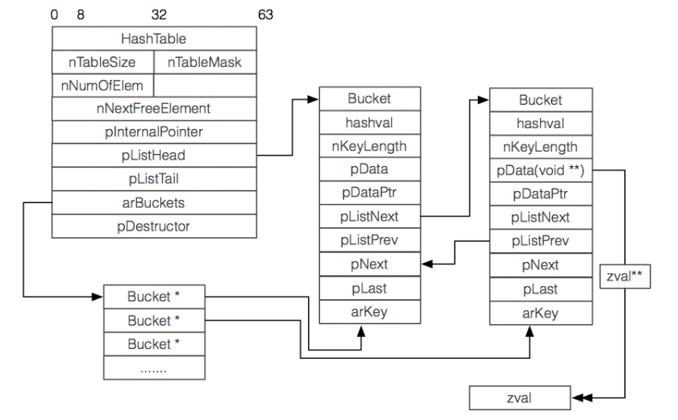
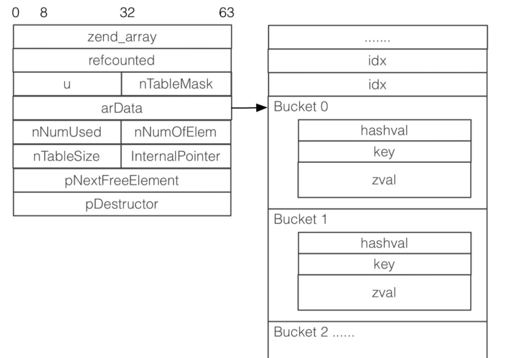

### php5数组和php7数组结构和区别

```
typedef struct _hashtable {  
    uint nTableSize;//4 哈希表中Bucket的槽的数量，初始值为8，每次resize时以2倍速度增长
    uint nTableMask;//4   nTableSize-1 ， 索引取值的优化
    uint nNumOfElements;//4  哈希表中Bucket中当前存在的元素个数，count()函数会直接返回此值
    ulong nNextFreeElement;//4  下一个数字索引的位置
    Bucket *pInternalPointer;   /* Used for element traversal 4*/  当前遍历的指针（foreach比for快的原因之一） 用于元素遍历
    Bucket *pListHead;//4  存储数组头元素指针
    Bucket *pListTail;//4  存储数组尾元素指针
    Bucket **arBuckets;//4  //指针数组,数组中每个元素都是指针 存储hash数组
    dtor_func_t pDestructor;//4   在删除元素时执行的回调函数，用于资源的释放 /* persistent 指出了Bucket内存分配的方式。如果persisient为TRUE，则使用操作系统本身的内存分配函数为Bucket分配内存，否则使用PHP的内存分配函数。*/
    zend_bool persistent;//1  
    unsigned char nApplyCount;//1  标记当前hash Bucket被递归访问的次数（防止多次递归）
    zend_bool bApplyProtection;//1  标记当前hash桶允许不允许多次访问，不允许时，最多只能递归3次
#if ZEND_DEBUG  
    int inconsistent;//4  
#endif  
} HashTable; 

typedef struct bucket {  
    ulong h;    /* Used for numeric indexing                4字节 */  对char *key进行hash后的值，或者是用户指定的数字索引值/* Used for numeric indexing */
    uint nKeyLength;    /* The length of the key (for string keys)  4字节 字符串索引长度，如果是数字索引，则值为0 */  
    void *pData;        /* 4字节 实际数据的存储地址，指向value，一般是用户数据的副本，如果是指针数据，则指向pDataPtr*/  //这里又是个指针，zval存放在别的地方
    void *pDataPtr;         /* 4字节 引用数据的存储地址，如果是指针数据，此值会指向真正的value，同时上面pData会指向此值 */  
    struct bucket *pListNext;  /* PHP arrays are ordered. This gives the next element in that order4字节 整个哈希表的该元素的下一个元素*/  
    struct bucket *pListLast;  /* and this gives the previous element           4字节 整个哈希表的该元素的上一个元素*/  
    struct bucket *pNext;      /* The next element in this (doubly) linked list     4字节 同一个槽，双向链表的下一个元素的地址 */  
    struct bucket *pLast;      /* The previous element in this (doubly) linked list     4字节 同一个槽，双向链表的上一个元素的地址*/  
    char arKey[1];            /* Must be last element   1字节 保存当前值所对于的key字符串，这个字段只能定义在最后，实现变长结构体*/  
} Bucket;
```



### PHP7数组结构体

```
typedef struct _HashTable { 
    union {
        struct {
            ZEND_ENDIAN_LOHI_3(
                zend_uchar    flags,
                zend_uchar    nApplyCount,  /* 循环遍历保护 */
                uint16_t      reserve)
        } v;
        uint32_t flags;
    } u;
    uint32_t          nTableSize;           /* hash表的大小 HashTable的大小，始终为2的指数（8,16,32,64...）。最小为8，最大值根据机器不同而不同*/
    uint32_t          nTableMask;           /* 掩码,用于根据hash值计算存储位置,永远等于nTableSize-1 */
    uint32_t          nNumUsed;             /* arData数组已经使用的数量 */
    uint32_t          nNumOfElements;       /* hash表中元素个数 */
    uint32_t          nInternalPointer;     /* 用于HashTable遍历 */
    zend_long         nNextFreeElement; /* 下一个空闲可用位置的数字索引 */
    Bucket           *arData;               /* 存放实际数据 */
    uint32_t         *arHash;               /* Hash表 */
    dtor_func_t       pDestructor;          /* 析构函数 */
} HashTable;

typedef struct _Bucket {
    zval              val;  
    zend_ulong        h;                /* hash value (or numeric index)   */
    zend_string      *key;              /* string key or NULL for numerics */
} Bucket;
```


新版本的数组结构，整块的数组元素和hash映射表全部连接在一起，被分配在同一块内存内。如果是遍历一个整型的简单类型数组，效率会非常快，因为，数组元素（Bucket）本身是连续分配在同一块内存里，并且，数组元素的zval会把整型元素存储在内部，也不再有指针外链，全部数据都存储在当前内存区域内。当然，最重要的是，它能够避免CPU Cache Miss（CPU缓存命中率下降）。

Zend Array的变化：
- 数组的value默认为zval。
- HashTable的大小从72下降到56字节，减少22%。
- Buckets的大小从72下降到32字节，减少50%。
- 数组元素的Buckets的内存空间是一同分配的。
- 数组元素的key（Bucket.key）指向zend_string。
- 数组元素的value被嵌入到Bucket中。
- 降低CPU Cache Miss。

