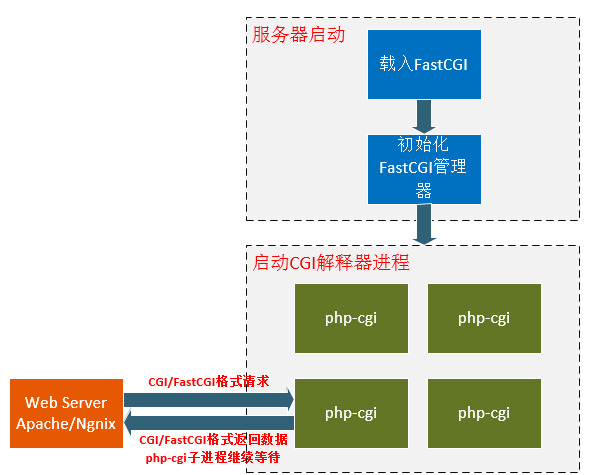

## cgi和fastcgi和php-fpm

---

### SAPI（Server Application Programming Interface）
服务器应用程序编程接口，即PHP与其他应用交互的接口，PHP脚本要执行有很多方式，通过Web服务器，或者直接在命令行下，也可以嵌入在其他程序中。SAPI提供了一个和外部通信的接口，常见的SAPI有：cgi、fast-cgi、cli、apache模块的DLL、isapi

### cgi
它的作用就是帮助服务器与语言通信，这里就是nginx和php进行通信，因为nginx和php的语言不通，因此需要一个沟通转换的过程，而CGI就是这个沟通的协议。
CGI（Common Gateway Interface）公共网关接口，是外部扩展应用程序与 Web 服务器交互的一个标准接口。服务器端与客户端进行交互的常见方式多，CGI 技术就是其中之一。根据CGI标准，编写外部扩展应用程序，可以对客户端浏览器输入的数据进行处理，完成客户端与服务器的交互操作。CGI规范定义了Web服务器如何向扩展应用程序发送消息，在收到扩展应用程序的信息后又如何进行处理等内容。对于许多静态的HTML网页无法实现的功能，通过 CGI可以实现，比如表单的处理、对数据库的访问、搜索引擎、基于Web的数据库访问等等。使用CGI实现客户端与服务器的交互有以下几个标准步骤，具体步骤如下：
- （1）Web 客户端的浏览器将URL的第一部分解码与Web服务器相连。
- （2）Web 浏览器将URL的其余部分提供给服务器。
- （3）Web 服务器将URL转换成路径和文件名。
- （4）Web 服务器发送 HTML 和别的组成请求页面的文件给客户。一旦页面内容传送完，
这个连接自动断开。
- （5）在客户端，HTML脚本提示用户做动作或输入。当用户响应后，客户请求Web服务器建立一个新的连接。
- （6）Web 服务器把这些信息和别的进程变量传送给由HTML以URL的形式指定CGI程序。
- （7）CGI 根据输入作出响应，把响应结果传送给 Web 服务器。
- （8）Web 服务器把响应的数据传给客户，完成后关闭连接。
服务器端 CGI 程序接收信息有三种途径：环境变量、命令行和标准输入。其中环境变量是指 CGI 定义一组环境变量，通过环境变量可传递数据。服务器收到来自浏览器的数据，调用 CGI 脚本，CGI 脚本将收到的数据转换成环境变量并从中取出所需要的内容。<form>标签的 METHOD 属性来决定具体使用哪一种方法。在“METHOD=GET”时，向 CGI 传递表单编码信息的是通过命令来进行的。表单编码信息大多数是通过环境变量 QUERY_STRING 来传递的。若“METHOD=POST”，表单信息通过标准输入来读取。还有一种不使用表单就可以向 CGI 传送信息的方法，那就是把信息直接附在 URL 地址后面，信息和URL 之间用问号（?）来进行分隔。GET 方法是对数据的一个请求，被用于获得静态文档。GET 方法通过将发送请求信息附加在 URL 后面的参数。当 GET 方法被使用时，CGI 程序将会从环境变量 QUERY_STRING获取数据。为了正确的响应客户端发来的请求，CGI 必须对 QUERY_STRING 中的字符串进行分析。当用户需要从服务器获取数据，但服务器上的数据不得改变时，应该用 GET 方法；但是如果请求中的字符串超过了一定长度，通常是 1024 字节，那么这时，只能用 POST 方法。POST 方法：浏览器将通过填写表单将数据传给服务器时一般采用POST 方法。在发送的数据超过 1024 字节时必须采用 POST 方法。当 POST 方法被使用时，Web 服务器向CGI 程序的标准输入 STDIN 传送数据。环境变量 CONTENT_LENGTH 存放着发送的数据长度。CGI 程序必须检查环境变量 REQUEST_METHOD 以确定有没有采用了 POST 方法，并决定是否要读取标准输入STDIN

---
**CGI程序的工作方式：**

Web服务器一般只处理静态文件请求（如 jpg、htm、html），如果碰到一个动态脚本请求（如php），web服务器主进程，就fork出一个新的进程来启动CGI程序，也就是说将动态脚本请求交给CGI程序来处理。启动CGI程序需要一个过程，比如，读取配置文件，加载扩展等。CGI程序启动后，就会解析动态脚本，然后将结果返回给Web服务器，最后Web服务器再将结果返回给客户端，刚才fork的进程也会随之关闭。
这样，每次用户请求动态脚本，Web服务器都要重新fork一个新进程，去启动CGI程序，由CGI程序来处理动态脚本，处理完后进程随之关闭。
这种工作方式的效率是非常低下的

**PHP 解释器是否嵌入 Web 服务器进程内部执行**:

后来，出现了一种比较高效的方式：Web服务器内置模块。例如，apache的mod_php模块。将php解释器做成模块，然后加载到apache服务器中。
这样，apache服务器在启动的时候，就会同时启动php模块。当客户端请求php文件时，apache服务器就不用再fork出一个新进程来启动php解释器，而是直接将php文件交给运行中的php模块处理。显然，这种方式下，效率会比较高。
由于在apache服务器启动时，才会读取php的配置文件，加载php模块，在apache的运行过程中。不会再重新读取php的配置文件。所以，每次我们修改了php的配置文件后，必须重启apache，新的php配置文件才会生效。
mod_php 通过嵌入 PHP 解释器到 Apache 进程中，只能与 Apache 配合使用，而 cgi 和 fast-cgi 以独立的进程的形式出现，只要对应的Ｗeb服务器实现 cgi 或者 fast-cgi 协议，就能够处理 PHP 请求。mod_php 这种嵌入的方式最大的弊端就是内存占用大，不论是否用到 PHP 解释器都会将其加载到内存中，典型的就是处理CSS、JS之类的静态文件是完全没有必要加载解释器。

### fastcgi
FastCGI就像是一个常驻（long-live）型的CGI程序，它可以一直运行着。FastCGI程序也可以和Web服务器分别部署在不同的主机上，它还可以接受来自其他Web服务器的请求。
FastCGI也是语言无关的。其主要行为是将CGI解释器进程保持在内存中并因此获得高效的性能。众所周知，CGI解释器的反复加载是CGI性能低下的主要原因。
FastCGI是一种进程管理工具，它可以在内存中管理CGI进程。
FastCGI进程管理器需要单独启动。启动FastCGI后，会生成一个FastCGI主进程和多个子进程（子进程其实就是CGI解释器进程）。
当客户端请求Web服务器上的动态脚本时，Web服务器会将动态脚本通过TCP协议交给FastCGI主进程，FastCGI主进程根据情况，安排一个空闲的子进程来解析动态脚本，处理完成后将结果返回给Web服务器，Web服务器再将结果返回给客户端。该客户端请求处理完毕后，FastCGI子进程并不会随之关闭，而是继续等待主进程安排工作任务。

**FastCGI的重要特点：**

1、FastCGI是HTTP服务器和动态脚本语言间通信的接口或者工具。
2、FastCGI优点是把动态语言解析和HTTP服务器分离开来。
3、Nginx、Apache、Lighttpd以及多数动态语言都支持FastCGI。
4、FastCGI接口方式采用C/S架构，分为客户端（HTTP服务器）和服务端（动态语言解析服务器）。
5、PHP动态语言服务端可以启动多个FastCGI的守护进程。
6、HTTP服务器通过FastCGI客户端和动态语言FastCGI服务端通信。

**原理**

一、Web Server启动时载入FastCGI进程管理器（Apache Module或IIS ISAPI等)
二、FastCGI进程管理器自身初始化，启动多个CGI解释器进程(可建多个php-cgi)，并等待来自Web Server的连接。
三、当客户端请求到达Web Server时，FastCGI进程管理器选择并连接到一个CGI解释器。Web server将CGI环境变量和标准输入发送到FastCGI子进程php-cgi。
四、FastCGI子进程完成处理后，将标准输出和错误信息从同一连接返回Web Server。当FastCGI子进程关闭连接时，请求便告处理完成。FastCGI子进程接着等待，并处理来自FastCGI进程管理器(运行在Web Server中)的下一个连接。 在CGI模式中，php-cgi在此便退出了
### php-cgi：
 php-cgi是php提供给web serve也就是http前端服务器的cgi协议接口程序，当每次接到http前端服务器的请求都会开启一个php-cgi进程进行处理，而且开启的php-cgi的过程中会先要重载配置，数据结构以及初始化运行环境，如果更新了php配置，那么就需要重启php-cgi才能生效，例如phpstudy就是这种情况。
 ### php-fpm:
 
 php-fpm是php提供给web serve也就是http前端服务器的fastcgi协议接口程序，它不会像php-cgi一样每次连接都会重新开启一个进程，处理完请求又关闭这个进程，而是允许一个进程对多个连接进行处理，而不会立即关闭这个进程，而是会接着处理下一个连接。它可以说是php-cgi的一个管理程序，是对php-cgi的改进。
 
 
 
 php-fpm会开启多个php-cgi程序，并且php-fpm常驻内存，每次web serve服务器发送连接过来的时候，php-fpm将连接信息分配给下面其中的一个子程序php-cgi进行处理，处理完毕这个php-cgi并不会关闭，而是继续等待下一个连接，这也是fast-cgi加速的原理，但是由于php-fpm是多进程的，而一个php-cgi基本消耗7-25M内存，因此如果连接过多就会导致内存消耗过大，引发一些问题，例如nginx里的502错误。
 
 
 
 同时php-fpm还附带一些其他的功能：
 
 
 
 例如平滑过渡配置更改，普通的php-cgi在每次更改配置后，需要重新启动才能初始化新的配置，而php-fpm是不需要，php-fpm分将新的连接发送给新的子程序php-cgi，这个时候加载的是新的配置，而原先正在运行的php-cgi还是使用的原先的配置，等到这个连接后下一次连接的时候会使用新的配置初始化，这就是平滑过渡。

 
 
